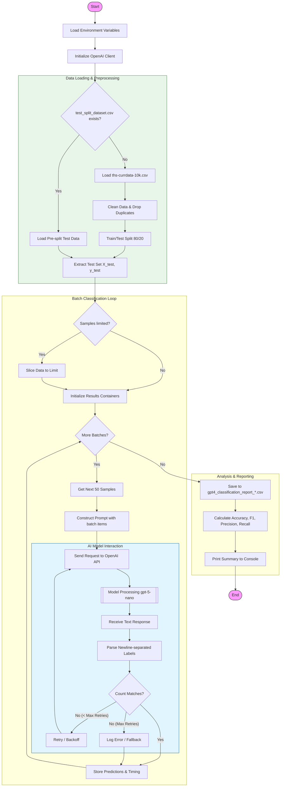

# AI Classification Pipeline Flowchart

```mermaid
flowchart TD
    %% Nodes
    Start([Start])
    LoadEnv[Load Environment Variables]
    InitClient[Initialize OpenAI Client]
    
    subgraph DataLoading [Data Loading & Preprocessing]
        CheckSplit{test_split_dataset.csv exists?}
        LoadSplit[Load Pre-split Test Data]
        LoadRaw[Load ths-currdata-10k.csv]
        CleanData[Clean Data & Drop Duplicates]
        SplitData[Train/Test Split 80/20]
        GetTestSet[Extract Test Set X_test, y_test]
    end

    subgraph BatchProcessing [Batch Classification Loop]
        CheckSampleLimit{Samples limited?}
        ApplyLimit[Slice Data to Limit]
        Initresults[Initialize Results Containers]
        LoopStart{More Batches?}
        GetBatch[Get Next 50 Samples]
        ConstructPrompt[Construct Prompt with batch items]
        
        subgraph AI_Interaction [AI Model Interaction]
            SendReq[Send Request to OpenAI API]
            ModelProcess[[Model Processing gpt-5-nano]]
            ReceiveResp[Receive Text Response]
            ParseResp[Parse Newline-separated Labels]
            Validate{Count Matches?}
            Retry[Retry / Backoff]
            LogError[Log Error / Fallback]
        end
        
        SaveBatchResults[Store Predictions & Timing]
    end

    subgraph Reporting [Analysis & Reporting]
        CalulateMetrics[Calculate Accuracy, F1, Precision, Recall]
        SaveCSV[Save to gpt4_classification_report_*.csv]
        PrintConsole[Print Summary to Console]
    end

    End([End])

    %% Edges
    Start --> LoadEnv
    LoadEnv --> InitClient
    InitClient --> CheckSplit
    
    CheckSplit -- Yes --> LoadSplit
    CheckSplit -- No --> LoadRaw
    LoadRaw --> CleanData
    CleanData --> SplitData
    SplitData --> GetTestSet
    LoadSplit --> GetTestSet
    
    GetTestSet --> CheckSampleLimit
    CheckSampleLimit -- Yes --> ApplyLimit
    CheckSampleLimit -- No --> Initresults
    ApplyLimit --> Initresults
    
    Initresults --> LoopStart
    LoopStart -- Yes --> GetBatch
    GetBatch --> ConstructPrompt
    ConstructPrompt --> SendReq
    
    SendReq --> ModelProcess
    ModelProcess --> ReceiveResp
    ReceiveResp --> ParseResp
    
    ParseResp --> Validate
    Validate -- No (< Max Retries) --> Retry
    Retry --> SendReq
    Validate -- No (Max Retries) --> LogError
    Validate -- Yes --> SaveBatchResults
    LogError --> SaveBatchResults
    
    SaveBatchResults --> LoopStart
    LoopStart -- No --> SaveCSV
    SaveCSV --> CalulateMetrics
    CalulateMetrics --> PrintConsole
    PrintConsole --> End

    %% Styles
    style Start fill:#f9f,stroke:#333
    style End fill:#f9f,stroke:#333
    style AI_Interaction fill:#e1f5fe,stroke:#01579b
    style DataLoading fill:#e8f5e9,stroke:#2e7d32
```
